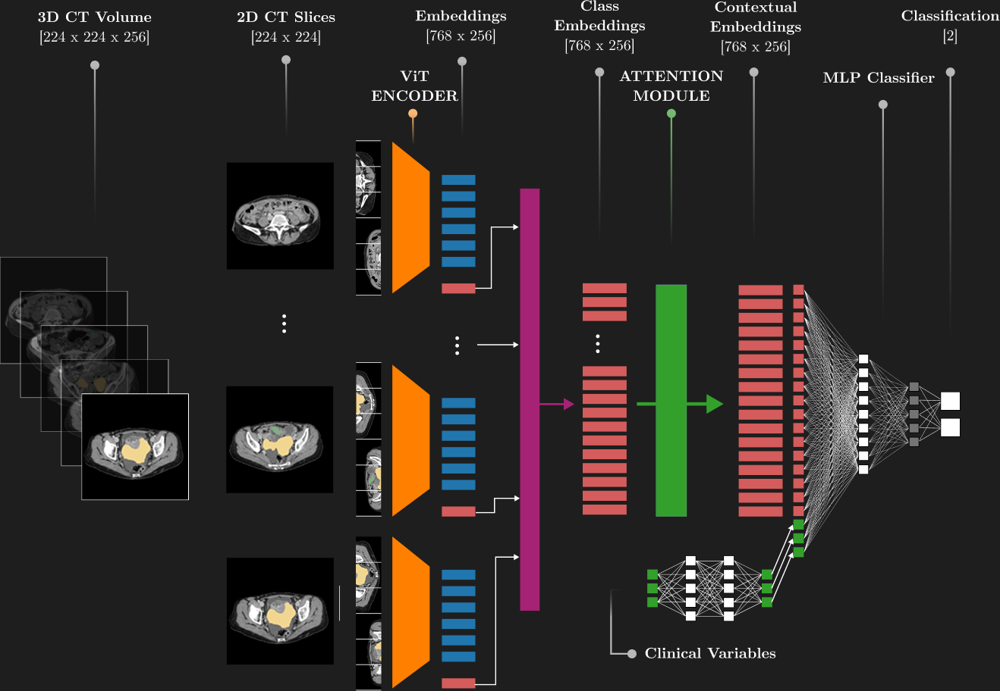

# UnderXAI-OVIT: OC_seg_analysis & PCS Classification Pipeline



This repository provides tools for:
- Computing lesion features (volume, surface area, compactness, fractal dimension, and number of sub-lesions) from NIfTI segmentation files.
- Training and evaluating a deep learning model for PCS (Primary Cytoreductive Surgery) classification using clinical and imaging data.
- Bootstrapped model evaluation for robust metric estimation.

## Getting Started

These instructions will get you a copy of the project up and running on your local machine for development and testing purposes.

### Prerequisites

- Python 3.7+
- Conda (Miniconda or Anaconda recommended)

### Installation

1.  **Clone the repository:**

    ```bash
    git clone https://github.com/your_username/UnderXAI-OVIT.git
    cd UnderXAI-OVIT
    ```

2.  **Create and activate a Conda environment:**

    ```bash
    conda create -n underxai python=3.9  # Or your preferred Python version >= 3.7
    conda activate underxai
    ```

3.  **Install dependencies:**

    ```bash
    pip install -r requirements.txt
    ```

## 1. Lesion Feature Extraction
This script computes lesion features from a local NIfTI segmentation file and saves results as a CSV file.

**Usage:**
```bash
python lesion_features_from_nifti.py --nifti /path/to/your_segmentation.nii.gz --output /path/to/output.csv
```
- `--nifti`: Path to the local NIfTI segmentation file
- `--output`: Path to the output CSV file

---

## 2. Main Pipeline: Training & Evaluation
Train and evaluate the PCS classifier using clinical and imaging data.

**Prepare a config file** (JSON format, see `config.yaml` for reference):
```json
{
  "train_paths": "./ds.json",
  "val_paths": "./ds.json",
  "test_paths": "./ds.json",
  "batch_size": 8,
  "epochs": 10,
  "learning_rate": 0.0001,
  "num_classes": 1,
  "feature_extractor": "google-32",
  "loss_function": "WBCE",
  "optimizer": "adamW",
  "weight_decay": 1e-6
}
```

**Run training and evaluation:**
```bash
python main.py --config config.json
```
- This will train the model, save the best checkpoint, and evaluate on the test set.
- Results and model checkpoints are saved in the `models/` directory.

---

## 3. Model Testing & Bootstrapping
Evaluate a trained model on a test dataset with bootstrapping for robust metrics.

**Edit the following paths in `test.py` as needed:**
- `TEST_DATA_PATH`: Path to your test dataset JSON
- `CONFIG_YAML_PATH`: Path to your model config YAML
- `CHECKPOINT_PATH`: Path to your trained model checkpoint

**Run the test script:**
```bash
python test.py
```
- This will run bootstrapped evaluation and save metrics and predictions as CSV files.

---

## 4. Configuration Files
- `config.yaml` and `config_sweep.yaml` provide example settings for training and hyperparameter sweeps.
- You can convert YAML to JSON for use with `main.py`.
- **Do not include sensitive data in config files.**

---

## 5. Directory Structure
```
UnderXAI-OVIT/
├── main.py                # Main training/evaluation pipeline
├── test.py                # Bootstrapped model evaluation
├── lesion_features_from_nifti.py  # Lesion feature extraction
├── model.py, engine.py, pcs_dataset.py, metrics.py, utilis.py  # Core modules for model definition, training loop, dataset handling, evaluation metrics, and utility functions.
├── config.yaml, config_sweep.yaml # Example configurations for training and hyperparameter sweeps.
├── ds.json                # Example dataset manifest (anonymized for public use).
├── requirements.txt       # Python dependency list.
├── README.md              # This README file.
├── LICENSE                # Project license.
└── ...                    # Other project files and directories.
```